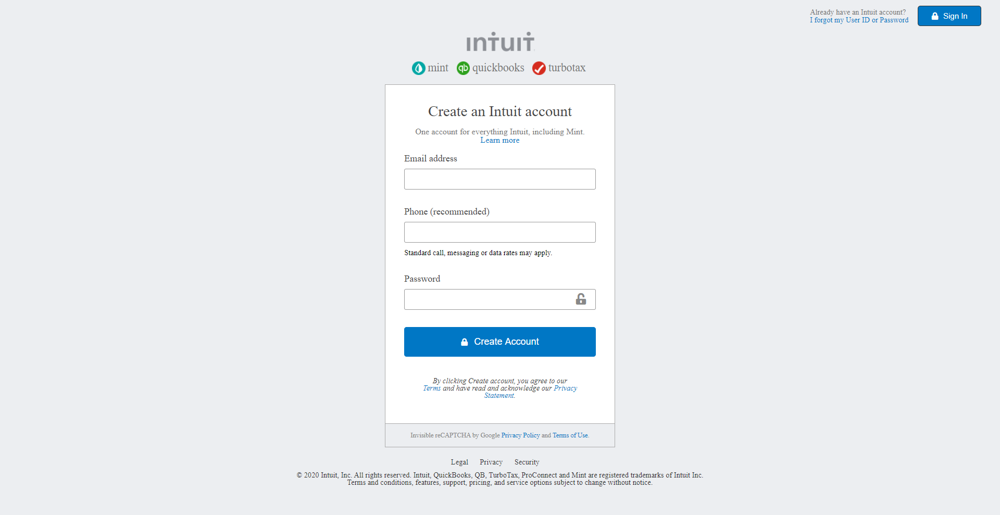

# Mint.com Signup Clone
> This project consists of building an HTML document that matches the appearance of mint.com’s signup page

Additional description about the project and its features.

## Built With

- Html
- CSS

## Live Demo

[Live Demo Link](https://rawcdn.githack.com/temesghentekeste/mint.com-signup-clone/dc30cc664c11709bbfbcaedacd6a112ac30d7d14/index.html)

## Getting Started

**Click on the link above in order to see the Live Demo of the front end project.**

To get a local copy up and running follow these simple example steps.

### Prerequisites
 - Web Browser
 - Text Editor

### Setup
 - Download repository files

## Authors

👤 **Author1**

- Github: [@krys2fa](https://github.com/krys2fa)
- Twitter: [@krys2fa](https://twitter.com/krys2fa)
- Linkedin: [linkedin](https://www.linkedin.com/in/christopher-amanor-81a7b93b/)

👤 **Author2**

- Github: [@temesghentekeste](https://github.com/temesghentekeste)
- Twitter: [@temesghentekes1](https://twitter.com/temesghentekes1)
- Linkedin: [linkedin](https://www.linkedin.com/in/temesghen-tekeste-bahta-8b5243193/)

## 🤝 Contributing

Contributions, issues and feature requests are welcome!

Feel free to check the [issues page](issues/).

## Show your support

Give a ⭐️ if you like this project!

## Acknowledgments

- Hat tip to anyone whose code was used
- Inspiration
- etc

## 📝 License

This project is [MIT](lic.url) licensed.
